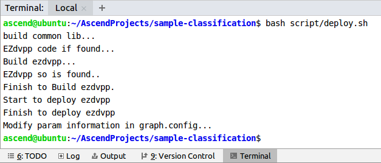
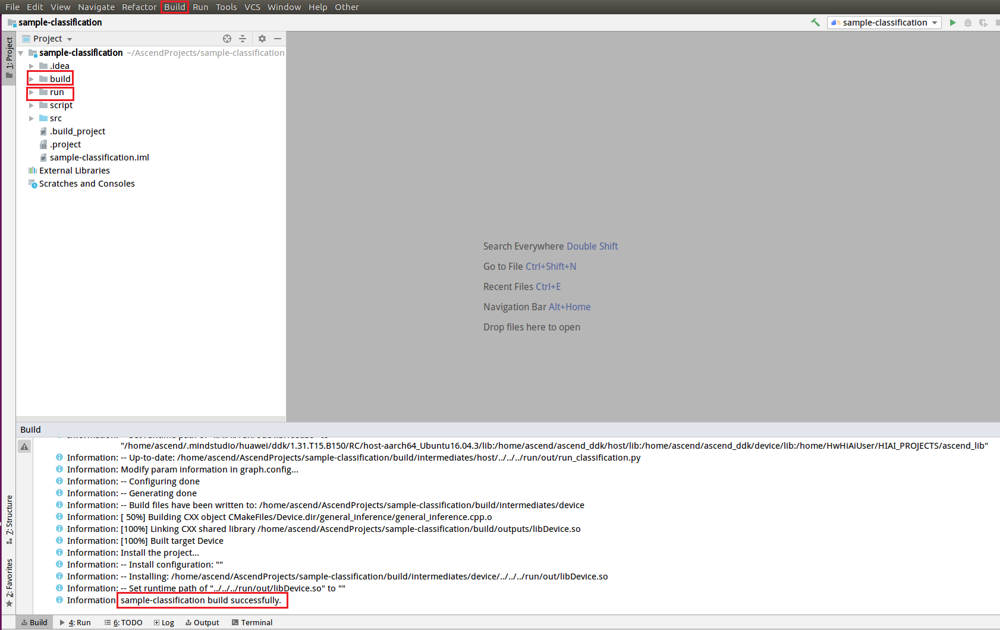

EN|[CN](Readme.md)

# Image Classification(C++)<a name="ZH-CN_TOPIC_0208837235"></a>

The classification application runs on the Atlas 200 DK or the AI acceleration cloud server and implements the inference function by using a common classification network, and the first n inference results are output.

## Prerequisites<a name="zh-cn_topic_0203223265_section137245294533"></a>

Before using an open source application, ensure that:

-   Mind Studio  has been installed.
-   The Atlas 200 DK developer board has been connected to  Mind Studio, the cross compiler has been installed, the SD card has been prepared, and basic information has been configured.。
## Deployment
1. Deployment: choose either faster-deployment or conventional deployment as shown below: 

   1.1 Faster deployment, refer to https://gitee.com/Atlas200DK/faster-deploy .
    > **NOTE：**   
    >-   This faster deployment script can quickly deploy multiple cases, select classification case for this project.
    >-   This faster deployment automatically performs code download, model conversion and environment variable configuration. For details, choose conventional deployment method, as shown in 1.2.
    
   1.2 Conventional deployment, refer to : https://gitee.com/Atlas200DK/sample-README/tree/master/sample-classification .
    > **NOTE：**   
    >-   This deployment method requires manually performing code download, model conversion and environment variable configuration. A better understand of the deployment process can be obtained from this method.

## Compile<a name="zh-cn_topic_0203223265_section18931344873"></a>

1.  Open the corresponding project.

       Enter the “**MindStudio-ubuntu/bin**” directory after decompressing the installation package in the command line, for example, **$HOME/MindStudio-ubuntu/bin**. Run the following command to start **Mind Studio**:

    **./MindStudio.sh**

    After successfully starting Mind Studio, open **sample-classification**project，as shown in [Figure 1](#zh-cn_topic_0203223265_fig11106241192810).

    **Figure 1**  Open classification project<a name="zh-cn_topic_0203223265_fig11106241192810"></a>  
    

2.  Configure related project information in **src/param\_configure.conf**.

    **Figure 2**  Configuration file path<a name="zh-cn_topic_0203223265_fig0391184062214"></a>  
    

    The configuration file is as follows:

    ```
    remote_host=
    model_name=
    ```

    Following parameter configuration needs to be added manually：

    -   remote\_host：this parameter indicates the IP address of Atlas 200 DK developer board.
    -   model\_name : name of the offline model

    An example of configuration is as follows:

    ```
    remote_host=192.168.1.2
    model_name=googlenet.om
    ```

    > **NOTE：**   
    >-   All the parameters must be filled in，otherwise build cannot be passed.
    >-   Note that the "" symbol is no need to be used when filling in parameters.
    >-   Only one single model name can be filled in the configuration file, the filled model must be one of the models saved in  [Step 5](#zh-cn_topic_0203223265_li470213205618). **googlenet** is used as an example here, it can be replaced by other models listed in this application. 

3.  Run the deployment script to adjust the configuration parameters, download and compile 3rd party libraries. Open the Terminal of **Mind Studio** tool, which is under the main code directory, run the following command to execute environment deployment in the backstage, as shown in [Figure 3](#zh-cn_topic_0182554577_fig19292258105419").
    
    **Figure 3**  Execute deployment script<a name="zh-cn_topic_0182554577_fig19292258105419"></a>  
    
    
    
    > **NOTE：**   
    >-   Automatic download and compilation will perform if 3rd party libraries are not deployed for the first time of deployment. This process might take some time, please wait patiently. It will not download and compilation repeatedly when recompiling later, deployment is shown as above. 
    >-   Select the HOST IP connected to the developer board when deploying, which is usually the IP of virtual network card. If this IP belongs to the same segment as the developer board IP, it will be selected automatically and deployed. Otherwise, manual entering the IP connected to developer board is required for deployment.
    
3.  Begin to compile, open **Mind Studio** tool, click **Build \> Build \> Build-Configuration** in the toolbar, shown as [Figure 4](#zh-cn_topic_0203223265_fig1741464713019), **build** and **run** folders will be generated under the directory.

    **Figure 4**  Compilation operation and generated files<a name="zh-cn_topic_0203223265_fig1741464713019"></a>  
    

    > **NOTE：**   
    >When you compile the project for the first time, **Build \> Build** is gray and not clickable. Your need to click **Build \> Edit Build Configuration**, configure the compilation parameters and then compile.  
    >  

4. Upload the images to be inferred to the directory of the  **HwHiAiUser**  user on the host.

    The image requirements are as follows:

    -   Format: JPG, PNG, and BMP.
    -   Width of the input image: the value is an integer ranging from 16px to 4096px.
    -   Height of the input image: the value is an integer ranging from 16px to 4096px.


## Running<a name="zh-cn_topic_0203223265_section372782554919"></a>

1. Find the **Run** button in the toolbar in **Mind Studio** tool, click **Run \> Run 'sample-classification'**, as shown in[Figure 7](#zh-cn_topic_0203223265_fig93931954162719), the executable program has been executed on the developer board.

    **Figure 7**  Executed program<a name="zh-cn_topic_0203223265_fig93931954162719"></a>  
    

    Please ignore the above error, because **Mind Studio** cannot pass parameters for executable programs.  The above steps are to deploy the executable program and the dependent library files to the developer board. This step requires ssh to developer board to the corresponding directory file and execute manually. For details, refer to the following steps.

2.  Log in to the Host as the  **HwHiAiUser**  user in SSH mode on Ubuntu Server where  Mind Studio  is located.

    **ssh HwHiAiUser@**_host\_ip_

    For the Atlas 200 DK, the default value of  _**host\_ip**_  is  **192.168.1.2**  \(USB connection mode\) or  **192.168.0.2**  \(NIC connection mode\).

3.  Go to the path of the executable file of classification application.

    **cd \~/HIAI\_PROJECTS/workspace\_mind\_studio/classification/out**

4.  Run the application.


    Run the  **run\_classification.py**  script to print the inference result on the execution terminal.

    Example command:


    **python3 run\_classification.py -w  _224_  -h  _224_  -i** **_./example.jpg_  -n  _10_**

    -   **-w/model\_width**: width of the input image of a model. The value is an integer ranging from 16px to 4096px. Obtain the input width and height required by each model by referring to the readme file of each model file on github. For details, see  [Table 1](#zh-cn_topic_0203223265_table1119094515272)
    -   **-h/model\_height**: height of the input image of a model. The value is an integer ranging from 16px to 4096px. Obtain the input width and height required by each model by referring to the readme file of each model file on github. For details, see  [Table 1](#zh-cn_topic_0203223265_table1119094515272)
    -   **-i/input\_path**: path of the input image. It can be a directory, indicating that all images in the current directory are used as input (Multiple inputs can be specified).
    -   **-n/top\_n**: the first  _n_  inference results that are output

    For other parameters, run the  **python3 run\_classification.py --help** command. For details, see the help information.


